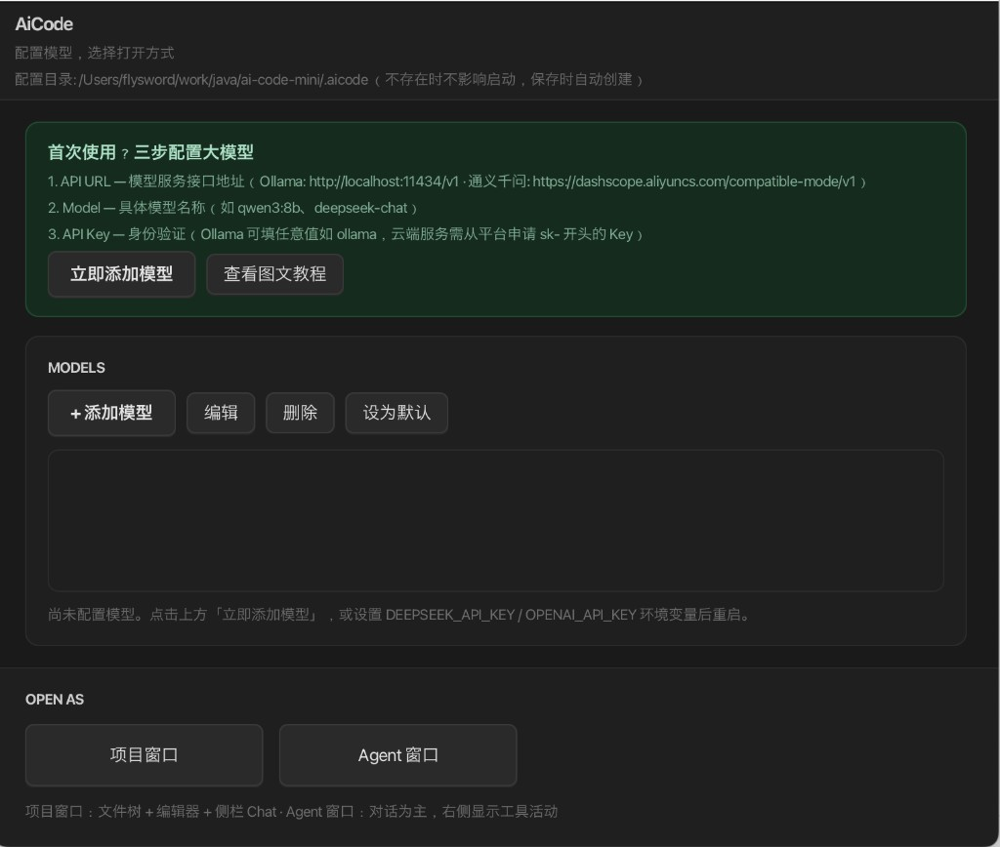
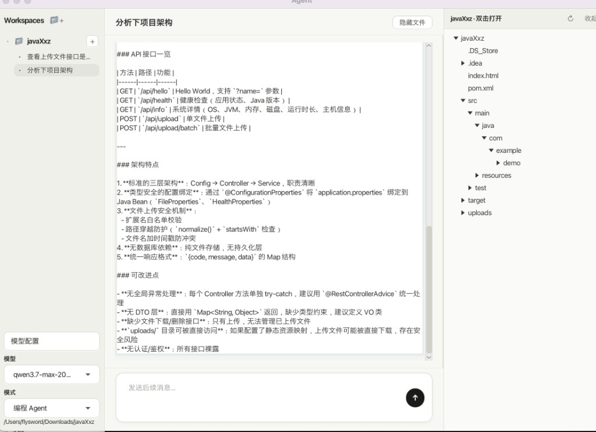

# AiCode Mini

基于 Java 21 + JavaFX 的 AI 编程助手桌面应用。支持连接 Ollama、DeepSeek、通义千问、Anthropic Claude 等 OpenAI 兼容或原生 API，在本地工作区中通过 Agent 自动读文件、搜索代码、执行命令、修改文件。



## 功能特性

- **Hub 启动页** — 图形化配置模型（API URL / 模型名 / API Key / Embedding 模型 / Agent 迭代上限），支持多模型管理与切换默认模型
- **项目窗口** — 文件树 + Monaco 代码编辑器 + 内置终端 + 侧边栏对话，适合在真实代码库中协作开发
- **Agent 窗口** — 以对话为主的全屏 Agent 界面，支持多工作区，右侧可展开文件编辑
- **内置工具** — `read_file`、`write_file`、`search_replace`、`delete_file`、`grep`、`glob`、`list_dir`、`bash`、`semantic_search`，以及任务清单（`task_*`）与 scratchpad（`scratchpad_*`）
- **Rules & Skills** — 自动发现 `.cursor/rules`、`.aicode/rules`、`.cursor/skills` 等 Cursor 风格配置
- **@ 引用** — 对话中 @ 文件、文件夹、选中代码、Codebase 语义检索
- **图片输入（Cursor 风格）** — 粘贴截图（⌘V / Ctrl+V）、拖放图片到输入框、或 @ 引用图片文件；输入框上方显示缩略图，支持 Vision 模型
- **CLI 模式** — 终端 REPL，适合脚本化或无图形界面环境
- **流式输出** — LLM 回复实时渲染，自动处理 token 上限重试
- **文件编辑审批** — Agent 写文件后可 diff 审查、接受或撤销



## 环境要求

| 工具 | 版本 |
|------|------|
| JDK | 21+（完整 JDK，含 `jpackage`） |
| Maven | 3.8+ |

## 快速开始

```bash
# 克隆仓库
git clone https://github.com/xuexiangzhong/ai-code-mini.git
cd ai-code-mini

# 本机调试：在 IDE 中运行 com.aicode.app.AiCodeMain，或
mvn javafx:run
```

首次启动会进入 **Hub 配置页**，按界面提示完成配置即可使用。

## 配置模型

### Hub 图形界面

1. **API URL** — 模型服务地址  
   - Ollama 本地：`http://localhost:11434/v1`  
   - 通义千问：`https://dashscope.aliyuncs.com/compatible-mode/v1`
2. **Model** — 模型名称，如 `qwen3:8b`、`deepseek-chat`、`gpt-4o`
3. **API Key** — Ollama 可填任意值（如 `ollama`），云端服务填 `sk-` 开头的 Key
4. **Provider** — 通常填 `openai-compatible`；Anthropic 官方 API 填 `anthropic`（URL 可留空）
5. **Embedding 模型** — 语义搜索用，默认 `text-embedding-3-small`；Ollama 可填 `nomic-embed-text`
6. **Agent 迭代上限** — 单轮对话中 Agent 最多工具循环次数，默认 20

也可通过环境变量 `EMBEDDING_MODEL` 覆盖 Embedding 模型（当 Hub 中留空时生效）。

点击「立即添加模型」保存后，选择「项目窗口」或「Agent 窗口」进入。

## 项目结构

```
ai-code-mini/
├── src/main/java/com/aicode/
│   ├── agent/          # Agent 核心：LLM 调用、工具执行、上下文压缩、代码索引
│   └── app/            # 桌面应用：UI、会话、配置、审批
├── src/main/resources/
│   ├── editor/         # Monaco Editor 内嵌资源
│   └── ui/             # JavaFX FXML 布局
├── images/             # README 示例截图
├── packaging/          # 图标与打包脚本
├── .github/workflows/  # CI（mvn test + package）
├── start.sh            # 启动脚本
└── package-mac.sh      # macOS / Windows 安装包打包
```

## 打包安装包

```bash
# macOS
./package-mac.sh

# Windows（需在 Windows 本机执行）
bash package-win.sh
```

## 开发

```bash
# 运行测试
mvn test

# 仅启动 JavaFX（开发调试）
mvn javafx:run
```

## 支持的 LLM 提供商

| 提供商 | providerType | 说明 |
|--------|--------------|------|
| OpenAI 兼容 | `openai-compatible` | DeepSeek、Ollama、通义千问、OpenAI 等 |
| Anthropic | `anthropic` | Claude 系列（原生 Messages API） |

## 第三方依赖

- [Monaco Editor](https://github.com/microsoft/monaco-editor) — 代码编辑器（MIT License）
- [JavaFX](https://openjfx.io/) — 桌面 UI 框架
- [OkHttp](https://square.github.io/okhttp/) — HTTP 客户端
- [Jackson](https://github.com/FasterXML/jackson) — JSON 序列化

## License

个人学习使用，协议以仓库实际勾选的协议为准。
